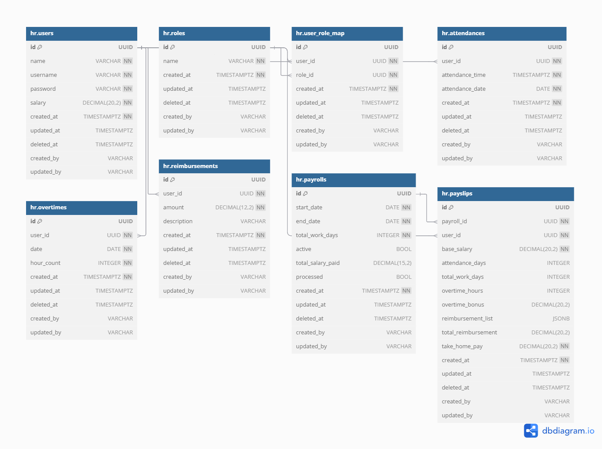

# SYSTEM ARCHITECTURE

## System Overview
A modular HR/Payroll backend in Go, designed to handle employee attendance, overtime, reimbursements, admin functionality, and payroll generation via REST API.

## Architecture Principles

* **Layered Architecture**: Clear separation between Handler → Logic → Repository → Database.
* **Dependency Injection**: Passing `CommonDependencies` (DB, logger, config) across layers, avoiding globals.
* **Clean Code**: Single-responsibility components, context-based logging, structured error handling.
* **Scalability**: Bulk-fetch data, in-memory grouping, bounded worker pools for concurrent payroll computation.
* **Immutability**: Snapshotting historical data (e.g. reimbursements JSON in payslips) to preserve state post-payroll.

## Core Components

| Layer               | Responsibilities                                                                                                                                                                                     |
| ------------------- | ---------------------------------------------------------------------------------------------------------------------------------------------------------------------------------------------------- |
| **Handler**         | HTTP endpoint definitions (login, attendance, overtime, reimbursements, payroll run, payslip viewer), request/response parsing, authentication/authorization.                                        |
| **Logic**           | Business rules: attendance validation, overtime restrictions, prorated salary calculations, payslip generation logic, worker pool orchestration.                                                     |
| **Repository**      | Direct DB interactions: migrations, CRUD for users, attendance, overtime, reimbursement, payroll periods, payslip inserts.                                                                           |
| **Database Schema** | Tables: `users`, `attendance_periods`, `attendances`, `overtimes`, `reimbursements`, `payrolls`, `payslips`. JSONB for snapshot fields. Foreign keys constraints, soft deletes via `deleted_at`. |

## Database Diagram

